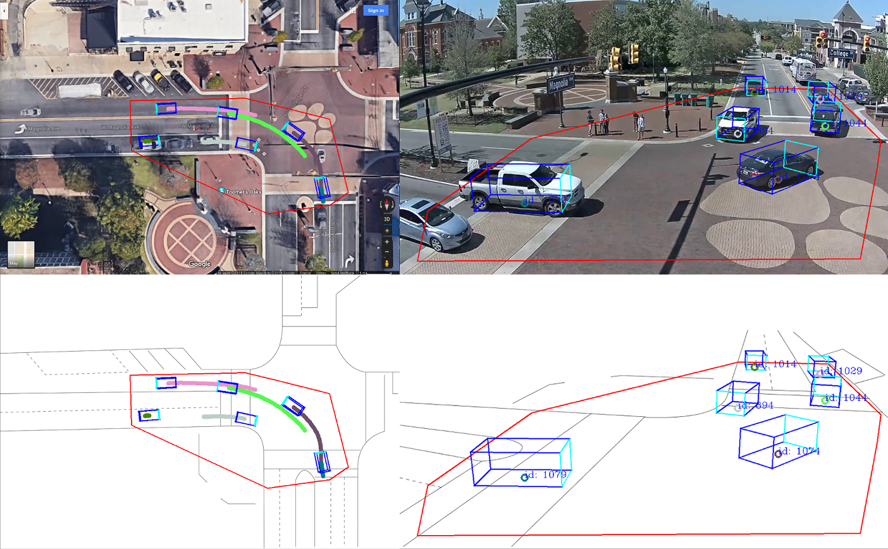

# Trajectory Extractor - Python Implementation

This is a python3 implementation of a framework to extract vehicle trajetcory from traffic camera.



## Setup

Pull submodules

```
git submodule update --init --recursive
```

Install `python3` and `virtualenv`: http://docs.python-guide.org/en/latest/dev/virtualenvs/

Instantiate the virtualenv, in the `python folder`:
```
virtualenv -p /usr/bin/python3 ve_trajectory-extractor
```
Before running the code, make sure you activate the virtualenv:
```
source ve_trajectory-extractor/bin/activate
```

Install requirements:
```
pip install -r req_virtual_env.txt
```

## Trajectory Extraction Process

The process of extracting vehicles trajectories from traffic camera is composed of:

- **Camera Calibration:** Estimate the position / orientation and focal length of the camera
- **Object Detection:** On each frame, detect object of interest (car, trucks, etc)
- **Detections Association:** Associate detections in successive frames to form tracks (e.g *tracking-by-detections*)
- **3D box fitting:** Fit generic fixed-size 3D box to the detection's mask provided by *Mask-RCNN* to obtain the vehicle position on the ground
- **Smoothing:** Smooth the tracks to obtain good trajectories

The framework is composed of seperate programs to allow for modularity and flexibility.

### Camera Calibration

Since we are interested in kinematics information of the objects (actual position on the ground, velocity), we need te determine the camera parameters:

- Position of the camera
- Orientation of the camera
- Focal Length (we assume the there is no distortion)

To calibrate the camera, you need to provide key-points pixel positions with their associated Lat/Lon coordinates (or NED position), usually obtained by looking them up on Google Earth).

Run:
```
cd traj_ext/camera_calib
python run_calib_manual.py --init
```

Config files:

- `CAMERA_CALIB_MANUAL_CFG.INI`: Configuration file
- `camera_calib_manual_cartesian.csv` or `camera_calib_manual_latlon.csv.INI`: Pixel and NED or Lat/Lon points

### Object Detection

Car (and potentially other objects of interest) are detected using `Mask-RCNN`.

You need to setup `Mask-RCNN` (https://github.com/matterport/Mask_RCNN), in the `Mask-RCNN` folder:

- Install `pycocotools`:  `git clone https://github.com/waleedka/coco && cd coco/PythonAPI && make && python setup.py install`
- Download the COCO trained weights in the : `wget 'https://cloud.mines-paristech.fr/index.php/s/YSxeVAkO2cElAE8/download'`

Once `Mask-RCCN` is setup properly, run:
```
cd traj_ext/object_det/mask-rcnn/
python run_detections_csv.py --init
```

Config files:

- `DETECTOR_MRCNN_CFG.INI`: Configuration file


**Note:** You can use `/object_det/run_saveimages.py` script to extract frames as images from a video file (mp4)

### Detections Association

To associate detections in successive frame to each others, we compute the overlap between masks in successive frames, inspired from `IOU Tracker`: https://github.com/bochinski/iou-tracker

Run:
```
cd traj_ext/det_association
python run_overlap_association.py --init
```

Config files:

- `OVERLAP_ASSOCIATION_CFG.INI`: Configuration file

### 3D box fitting

From the masks detected by `Mask-RCNN`, we compute a 3D box associated by maximizing the overlap between the mask and the 3D box projected in the image plane. This allows to reduce the re-projection error when computing the 3D world position of the vehicle from the detection in the image.

Run:
```
cd traj_ext/3Dbox_fitting/box_detection
python run_optim_3Dbox_mono.py --init
```

Config files:

- `OPTIM_3DBOX_MONO.INI`: Configuration file

### Smoothing

In order to get the 3D world position and velocity of the vehicles, we run a RTS Smoother.

Run:
```
cd traj_ext/post-process_track
python 3Dbox_fitting/run_postprocess_tracker.py --init
```

Config files:

- `TRACKER_POSTPROCESS_CFG.INI`: Configuration file

## Notes:

The output of each block consists of img and/or csv files and serves as input for other blocks.
A suggested structure of the output folder:
```
DATA
└─── img (images from the video)
|
└─── output
|    └─── det
|         └─── csv
|         └─── img
|    └─── overlap_association
|         └─── csv
|         └─── img
|    └─── 3D_box
|         └─── csv
|         └─── img
|    └─── track
|         └─── csv
|         └─── img
```


## Performance Evaluation

The performances evluations scripts are in the `eval` folder.

### Tracking accuracy

We used CVAT (https://github.com/opencv/cvat) to manually label about 100 trajectories of the auburn intersection.

Download the dataset used for the accuracy evaluation:

```
cd traj_ext/eval/accuracy
wget 'https://cloud.mines-paristech.fr/index.php/s/LgYrVIdyBnP3C8l'
```

Then, then the scripts used to evaluate the trajectory accuracy can be found in `traj_ext/eval/accuracy`:

- `run_accuracy_eval.py`
- `run_tracking_coverage.py`

### Tracking performance

To evaluate the tracking precision, we generate videos with ground-truth position and velocity for vehicles using CARLA (https://github.com/carla-simulator/carla)

Download the dataset used for the precision evaluation:

```
cd traj_ext/eval/precision
wget 'https://cloud.mines-paristech.fr/index.php/s/yxQ8SDvVOqAELeN'
```

Then, script used to evaluate the trajectory precision can be found `eval/precision`:

- `run_traj_precision.py`

## Utils

 Create a video from images:
```
ffmpeg  -framerate 15 -pattern_type glob -i '*.png' video.mp4
```

Slice video:

```
ffmpeg -i source-file.foo -ss 0 -t 600 first-10-min.m4v
```

## List of available livefeeds:

- Miami: https://www.youtube.com/watch?v=0PV3IPKn48U
- La grange: https://www.youtube.com/watch?v=flL3js0z7JE
- Biloxi: https://www.youtube.com/watch?v=mRUqadKIFMM
- Zambrów: https://www.youtube.com/watch?v=HfTTx1uoLcY