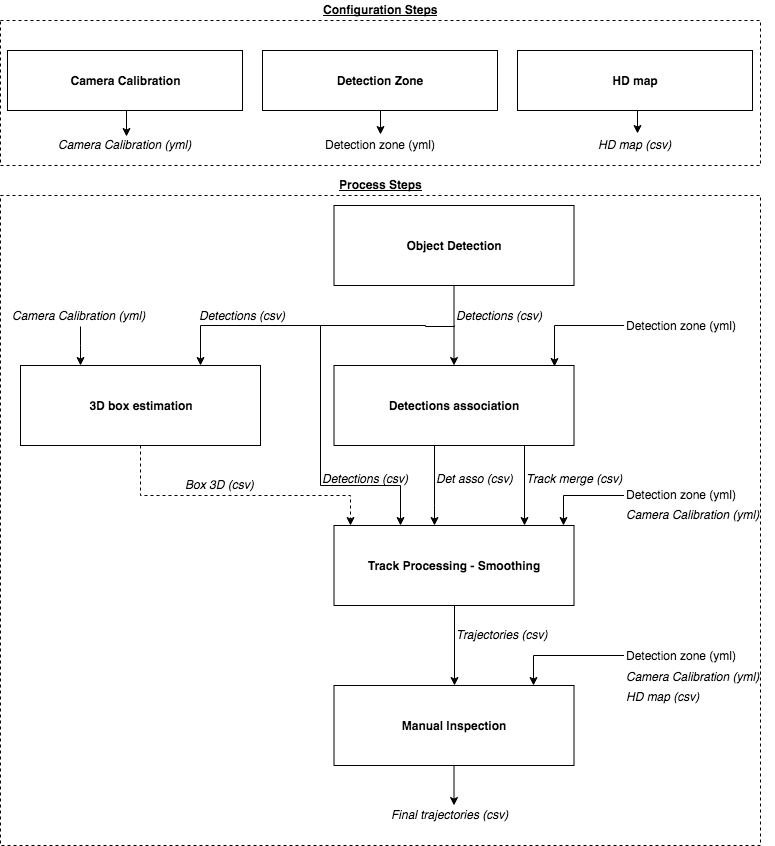
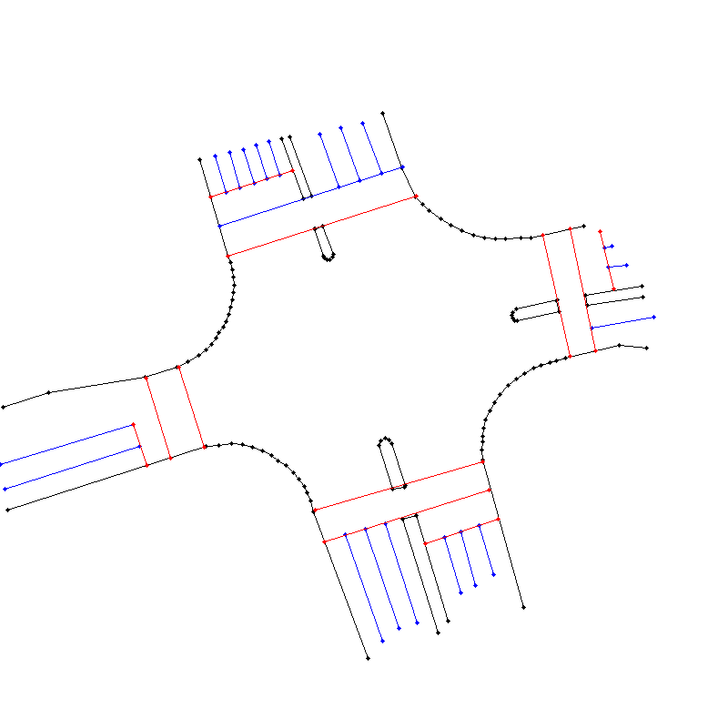
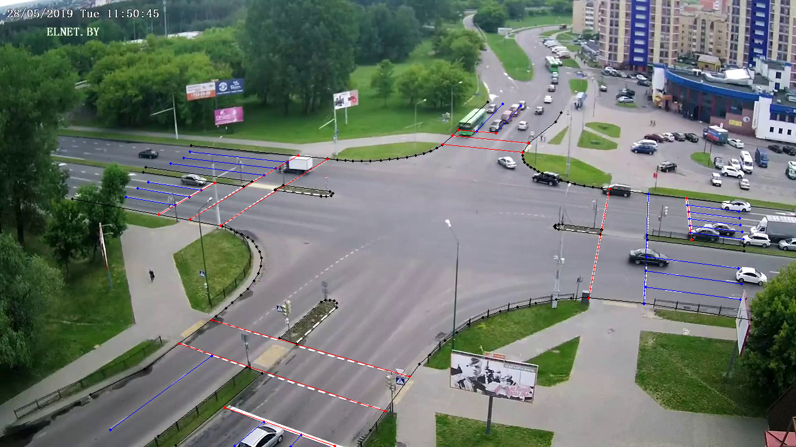
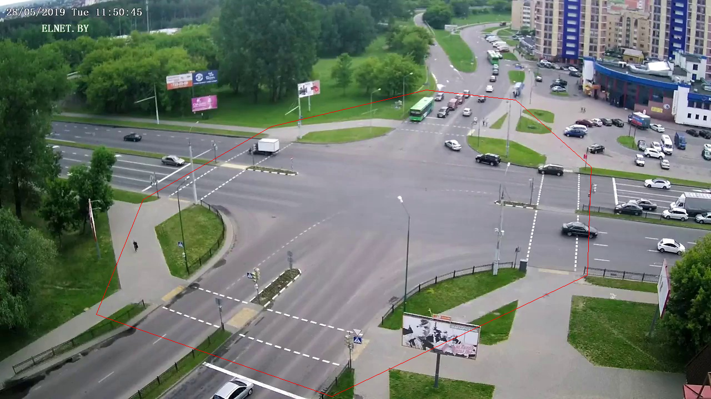

# Trajectory Extractor - Python Implementation

This is a python3 implementation of a framework to extract vehicle trajectories from traffic cameras.


**DISCLAIMER: This project is not actively maintained and the code is provided as is.**

## Setup

Update submodules:

    git submodule update --init --recursive

Setup a virtual environment with **`Python 3`**:

    virtualenv -p /usr/bin/python3 ve_trajectory-extractor
    source ve_trajectory-extractor/bin/activate

Install dependencies:

    pip install -e .

**Note:** If `pip install -e .` fails because of `numpy` and `Cython`, you can install them mannually `pip install numpy Cython` before running `pip install -e .`

Download and save `mask_rcnn_coco.h5` weights in `traj_ext/object_det/mask_rcnn/Mask_RCNN/`: https://github.com/matterport/Mask_RCNN/releases/download/v2.0/mask_rcnn_coco.h5

## Quick start

The `run_trajectory_extraction.sh` provides a short example to run the full pipeline for a given video:

    ./run_trajectory_extraction.sh

**Note:** By default it process the video used for test data, but the video can be changed in the script.

## Limitations

This tool is limited by:
- Not robust to occlusions as the detection-to-track association relies on visual information (detection overlap and visual tracking)
- Tracks can jump from one target object to another (identity switch):
    -  Due to erroneous detections taking two distinct objects as one single one
    -  High velocity of the target: Detections overlap in successive frame because two objects moved quicker than the framerate

To limit the occurrence of *identity switches*, re-training the detection network can improve detections, and therefore decrease the number of erroneous detections and *identity switches*.

Please refer to the [Manual Inspection](#manual-inspection) section to see how to use the manual inspection tool to correct/fix erroneous trajectories.

## Citing

If you use this project in your work, please consider citing it with:

```
@INPROCEEDINGS{8814095,
author={A. {Clausse} and S. {Benslimane} and A. {de La Fortelle}},
booktitle={2019 IEEE Intelligent Vehicles Symposium (IV)},
title={Large-Scale extraction of accurate vehicle trajectories for driving behavior learning},
year={2019},
volume={},
number={},
pages={2391-2396},
keywords={cameras;image processing;learning (artificial intelligence);road vehicles;traffic engineering computing;autonomous vehicles;pedestrians;machine learning methods;single fixed monocular traffic cameras;driving behavior learning;vehicle trajectory dataset creation;vehicle trajectory extraction},
doi={10.1109/IVS.2019.8814095},
ISSN={},
month={June},}
```

## Trajectory Extraction Process

The process of extracting vehicles trajectories from traffic camera is composed of several steps. It is decomposed in different processes to allow for modularity and flexibility. The different processes generate outputs that will serve as inputs to the next steps (usually `csv` files).

**Main steps:**

- **Camera Calibration:** Estimate the position / orientation and focal length of the camera
- **Object Detection:** On each frame, detect object of interest (car, trucks, etc)
- **Detections Association:** Associate detections in successive frames to form tracks (e.g *tracking-by-detections*)
- **Smoothing:** Smooth the tracks to obtain good trajectories based on a dynamical model and measurement model (RTS smoother)

**Optional steps:**
- **3D box fitting:** Fit generic fixed-size 3D box to the detection's mask provided by *Mask-RCNN* to obtain the vehicle position on the ground
- **Manual Inspection:** Allows to manually
    - Detections:
        - Delete wrong detections: e.g detections that merges several vehicles into one detections, etc
        - Add detections to improve the tracking performances
    - Merge tracks:
        - Merge tracks that correspond to the same agent if they have not been merged by the track_merge process
        - Correct for wrong tracks merge: Visual trackers might merge tracks from different vehicles
    - Change track agent_type: e.g car, truck, bus, etc
- **HD Map:** Create a map of the area from the camera point of view to ensure trajectory alignment with the map



### Calibration

#### Camera Calibration

Since we are interested in kinematics information of the objects (actual position on the ground, velocity), we need to determine the camera parameters:
- Position of the camera
- Orientation of the camera
- Focal Length (we assume the there is no distortion)

**Details can be found in:** [Trajectory Extractor Write-Up](documentation/trajectory_extractor.pdf)

To calibrate the camera, you need to provide keypoints pixel positions with their associated Lat/Lon coordinates (or NED position), usually obtained by looking them up on Google Earth).

Run:

    python traj_ext/camera_calib/run_calib_manual.py --help

Generate input file with `-init` flag, and fill `camera_calib_manual_cartesian.csv` or `camera_calib_manual_latlon.csv` with keypoints pairs:
- Pixel positions
- NED or Lat/Lon points

**Note**: For satellite view, add the `-satellite` flag to set the focal length of the camera manually to avoid singularity.

Input:
- Key points: `camera_calib_manual_cartesian.csv` or `camera_calib_manual_latlon.csv`

Outputs:
- Camera Calibration:  `XXXXX_cfg.yml`

#### HD map

It is possible to create a HD map from the camera view using the previously obtained camera model.

Run:

    python traj_ext/hd_map/run_generate_HD_map.py --help

Inputs:
- Camera image
- Origin lat/lon

Outputs:
- HD map `XXXXX_hd_map.csv`

 

#### Detection Zone

In the camera field of view, it is possible to define a detection zone that will be used to track agents only in this zone.

Run:

    python traj_ext/camera_calib/run_detection_zone.py --help

Inputs:
- Camera image
- Camera calibration `XXXXX_cfg.yml`

Outputs:
- Detection Zone FNED `XXXXX_detection_zone.yml`
- Detection Zone Image `XXXXX_detection_zone_im.yml`

 

### Object Detection

Once `Mask-RCCN` is setup properly, run:

    python traj_ext/object_det/mask-rcnn/run_detections_csv.py --help

Inputs:
- Images
- Cropping coordonates

Outputs:
- Detections files: `det/csv/`
- Detections images: `det/img/`

**Note:**
- You can use `/object_det/run_saveimages.py` script to extract frames as images from a video file (mp4)
- To improve performances, the object detector can be re-trained / fine-tuned for a specific traffice camera: https://github.com/matterport/Mask_RCNN#training-on-your-own-dataset

**Issues:** Please refer to https://github.com/matterport/Mask_RCNN if you have some trouble setting-up `Mask-RCNN`

### Detections Association

This steps aims at grouping detections into tracks, it consists of two steps:
- Detection associations: We compute the overlap between masks in successive frames and we associate the best matching pairs (inspired from `IOU Tracker`: https://github.com/bochinski/iou-tracker)
- Track merging: When a track ends in the middle of the detection zone, we create a visual tracker (`CRST` tracker) to try to match it with a track that starts afterwards (bridging gaps in tracking)

Run :

    python traj_ext/det_association/run_det_association.py --help

Inputs:
- Images
- Detections files: `det/csv/`
- Detection Zone Image `XXXXX_detection_zone_im.yml`

Outputs:
- Detections association files: `det_asso/csv`
- Detections association images: `det_asso/img`
- Track merge: `det_asso/XXXXXX_tracks_merge.csv`

### 3D box fitting

From the masks detected by `Mask-RCNN`, we compute a 3D box associated by maximizing the overlap between the mask and the 3D box projected in the image plane. This allows to reduce the re-projection error when computing the 3D world position of the vehicle from the detection in the image.

Run:

    python traj_ext/3Dbox_fitting/box_detection/run_optim_3Dbox_mono.py --help

Inputs:
- Images
- Detections files: `det/csv/`
- Camera Calibration:  `XXXXX_cfg.yml`

Outputs:
- Box estimation files: `box3D/csv`
- Box estimation images: `box3D/img`

### Process: Trajectory Smoothing

This step aims at taking the raw tracks measurements and create smooth world frame trajectories with: position, velocity and heading of the vehicles using a *Rauch-Tung-Striebel Smoother*. It uses:
- Process model: [Bycicle Model](https://www.researchgate.net/profile/Philip_Polack/publication/318810853_The_kinematic_bicycle_model_A_consistent_model_for_planning_feasible_trajectories_for_autonomous_vehicles/links/5addcbc2a6fdcc29358b9c01/The-kinematic-bicycle-model-A-consistent-model-for-planning-feasible-trajectories-for-autonomous-vehicles.pdf) to capture the underlying kinematics of vehicles
- Measurement model: [Pin-Hole camera model](https://web.stanford.edu/class/cs231a/course_notes/01-camera-models.pdf) to capture the noise / uncertainty directly from pixel position.

**Details can be found in:** [Trajectory Extractor Write-Up](documentation/trajectory_extractor.pdf)

Run:

    python traj_ext/postprocess_track/run_postprocess.py --help

Inputs:
- Images
- Detections files: `det/csv/`
- Detections association files: `det_asso/csv`
- Track merge: `det_asso/XXXXXX_tracks_merge.csv`
- Camera Calibration:  `XXXXX_cfg.yml`
- Detection Zone FNED `XXXXX_detection_zone.yml`

Outputs:
- Trajectories: `traj/csv/XXXXX_traj.csv`
- Trajectories time: `traj/csv/XXXXX_time_traj.csv`
- Trajectories meta: `traj/csv/XXXXX_traj_meta.csv`
- Trajectories not merged: `traj/csv/XXXXX_traj_not_merged.csv`
- Trajectory ignore: `traj/csv/XXXXX_traj_ignore.csv`
- Trajectory time ignore: `traj/csv/XXXXX_time_ignore.csv`
- Trajectory traj reverse: `traj/csv/XXXXX_traj_reverse.csv`
- Trajectory type correct: `traj/csv/XXXXX_traj_type_corr.csv`

### Manual inspection

#### Trajectory inspector

After the smoothing of the trajectories, we can manually inspect the trajectories to correct for erroneous:
- Detections:
    - Delete wrong detections: e.g detections that merges several vehicles into one detections, etc
    - Add detections to improve the tracking performances
- Merge tracks:
    - Merge tracks that correspond to the same agent if they have not been merged by the track_merge process
    - Correct for wrong tracks merge: Visual trackers might merge tracks from different vehicles
- Change track agent_type: e.g car, truck, bus, etc

Run:

    python traj_ext/visualization/run_inspect_traj.py --help

Inputs:
- Images
- Detections files: `det/csv/`
- Detections association files: `det_asso/csv`
- Track merge: `det_asso/XXXXXX_tracks_merge.csv`
- Camera Calibration:  `XXXXX_cfg.yml`
- Detection Zone FNED `XXXXX_detection_zone.yml`
- Trajectories: `traj/csv/XXXXX_traj.csv`
- Trajectories time: `traj/csv/XXXXX_time_traj.csv`
- Trajectories meta: `traj/csv/XXXXX_traj_meta.csv`
- Trajectories not merged: `traj/csv/XXXXX_traj_not_merged.csv`
- Trajectory ignore: `traj/csv/XXXXX_traj_ignore.csv`
- Trajectory time ignore: `traj/csv/XXXXX_time_ignore.csv`
- Trajectory traj reverse: `traj/csv/XXXXX_traj_reverse.csv`
- Trajectory type correct: `traj/csv/XXXXX_traj_type_corr.csv`

Output:
- Trajectories: `traj_inspect/csv/XXXXX_traj.csv`
- Trajectories time: `traj/csv/XXXXX_time_traj.csv`

**Note**:
- Adding / Deleting detections requires to re-run the *Detection Association* step
- Adding / Deleting detections association requires to re-run the *Traj PostProcess - Smoothing* step
- Changing the Track Merge requires to re-run the *Traj PostProcess - Smoothing* step
- Changing the Agent Type requires to re-run the *Traj PostProcess - Smoothing* step

#### Trajectory visualizer

The visualizer provides a way to visualize the trajectories on the camera images, as well as on the bird-view map.
It also allows to export annotated images with the trajectories.

Run:

    python traj_ext/visualization/run_visualizer.py --help


## Notes:

The output of each block consists of img and/or csv files and serves as input for other blocks.
The directory structure is flexible, but here is a suggested folder structure (used in the `run_trajectory_extraction.sh` example script:

```
DATA
└─── img (images from the video)
└─── output
|    └─── vehicles
|         └─── det
|              └─── csv
|              └─── img
|         └─── det_association
|              └─── csv
|              └─── img
|              └─── XXXXXX_tracks_merge.csv
|         └─── box3D
|              └─── csv
|              └─── img
|         └─── traj
|              └─── csv
|              └─── img
|         └─── traj_inspect
|              └─── csv
|    └─── pedestrians
|         └─── det
|              └─── csv
|              └─── img
|         └─── det_association
|              └─── csv
|              └─── img
|              └─── XXXXXX_tracks_merge.csv
|         └─── box3D
|              └─── csv
|              └─── img
|         └─── traj
|              └─── csv
|              └─── img
|         └─── traj_inspect
|              └─── csv
|    └─── visualizer
|         └─── img_annotated
|         └─── img_hdmap
|         └─── img_concat
|         └─── img_raw
└─── XXXXXX_detection_zone.yml
└─── XXXXXX_detection_zone_im.yml
└─── XXXXXX_cam_street_cfg.yml
└─── XXXXXX_cam_street.png
└─── XXXXXX_cam_sat_cfg.yml
└─── XXXXXX_cam_sat.png
└─── XXXXXX_hd_map.csv

```

## Utils

### Videos

 Create a video from images:

    ffmpeg  -framerate 10 -pattern_type glob -i '*.png' video.mp4

Slice video:

    ffmpeg -i source-file.foo -ss 0 -t 600 first-10-min.m4v

### Virtual Env

Install `python3` and `virtualenv`: http://docs.python-guide.org/en/latest/dev/virtualenvs/

Instantiate the virtualenv, in the `python folder`:

    virtualenv -p /usr/bin/python3 ve_trajectory-extractor

Before running the code, make sure you activate the virtualenv:

    source ve_trajectory-extractor/bin/activate
